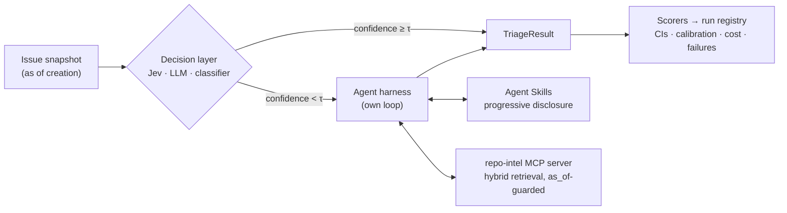

# triagelab

**An eval-driven GitHub issue-triage system.** A cheap, typed decision model handles routine calls. An LLM agent with MCP tools and repo-specific Agent Skills handles the hard ones. Every design choice is justified by measurement: accuracy with confidence intervals, calibration, cost and failure analysis.

[](https://github.com/ish-codes-magic/triage-bench/actions/workflows/ci.yml)


[](LICENSE)

> **Status: M0–M2 of 10 complete** (foundations, dataset, baselines and scoring). Results so far are on the dev split with silver labels; the test set stays locked until M8. Negative results are reported as prominently as positive ones.

---

## The question

Most LLM demos show that something *works*. This project asks **when it is worth it**, and tests five hypotheses instead of assuming them:

| | Hypothesis |
|---|---|
| **H1** | Repo-specific Agent Skills beat generic instructions, at an acceptable token cost. |
| **H2** | Retrieving context on demand via MCP tools beats stuffing it into the prompt, on both accuracy and cost. |
| **H3** | A typed decision model with confidence-based escalation matches the full agent on routine decisions at a fraction of the cost. |
| **H4** | The harness transfers to a new repository by swapping only the skill. |
| **H5** | Each decision backend's confidences are (or are not) well calibrated in this domain. |

**Tasks:**
- issue labels (T1)
- duplicate detection (T2)
- component routing (T3)
- needs-more-info detection (T4)
- a draft triage comment (T5), scored by an LLM judge that is itself validated against human labels

Ground truth comes from real maintainer actions on public repositories. Every input is frozen at issue-creation time, and tests enforce that no later information leaks in.

## Architecture



- **Evaluation is offline and frozen:** dataset snapshots, a local index, and cached model responses, so any run can be reproduced exactly.
- **The core is written from scratch:**
  - the agent loop
  - progressive skill loading
  - the cascade policy
  - every metric, including bootstrap CIs and calibration

  This is deliberate: the point is to understand what agent frameworks hide.

## First results: do cheap baselines already solve it? (E1)

**Dev split (n = 100), silver labels, 95% bootstrap intervals.** This is not the headline test-set table yet: the test set stays locked until M8.

| system | T1 labels micro-F1 | T1 area F1 | T3 component acc. | T3 top-3 | T4 needs-info F1 | $/issue |
|---|---|---|---|---|---|---|
| majority class | 0.40 [0.32, 0.49] | 0.37 [0.26, 0.49] | 0.26 [0.15, 0.38] | 0.76 | 0.00 | $0 |
| **TF-IDF + logistic regression** | **0.71 [0.64, 0.77]** | **0.65 [0.56, 0.74]** | 0.65 [0.52, 0.77] | **0.94** | 0.09 [0.00, 0.26] | $0 |
| Qwen3.5-9B, single call, no tools | 0.59 [0.54, 0.64] | 0.57 [0.48, 0.67] | 0.69 [0.56, 0.80] | 0.89 | 0.20 [0.05, 0.36] | $0.00015 |

- **Negative result first.** A 9B model with generic instructions is **significantly worse than TF-IDF at labelling**: paired difference −0.12 [−0.19, −0.06] in T1 micro-F1.
  - On components and needs-info there's no evidence either way at this sample size.
  - That's the bar the agent, with skills and retrieval tools (M3–M4), has to clear.
- **Duplicates need retrieval.** Lexical nearest-neighbour search finds almost none (link-F1 0.11 [0.00, 0.32]), and a model without tools can't find them at all.
- **The first measured iteration was a prompt-formatting fix.**
  - The prompt listed labels as `area: stdlib, …`, and the model answered `area-stdlib` on 57% of issues.
  - Listing exact strings raised area F1 by **+0.475 [+0.349, +0.591]**.
  - This was caught because invented labels are recorded, not silently dropped. → [iteration log](docs/ITERATIONS.md)

Full table: [reports/results/dev.md](reports/results/dev.md) (regenerated from the run registry with `triagelab results --split dev`).

## The dataset: CPython issues, exactly as they were opened

5,476 [python/cpython](https://github.com/python/cpython) issues (May 2025 – Aug 2026), with silver ground truth for all four tasks. See the [dataset card](data/DATASET_CARD.md) and the [generated report](reports/data/python__cpython.md).

- **Leakage, measured.**
  - **70% of CPython issue bodies today name the PR that fixed them**: a bot appends a "Linked PRs" section after triage.
  - Every snapshot is rebuilt from GitHub's edit history as of the moment the issue was opened: **0 of 5,476 snapshots contain that section.**
  - A mutation test proves that no post-creation field can change what the model sees. It runs as its own CI check ("Leakage guard").
- **Chosen by evidence.**
  - The obvious candidate (transformers) looked 100% labelled, but only 3% of its recent issues had a label applied by a human triager; the rest came from issue templates.
  - Repos were compared by *who applied each label*. → [ADR-0011](docs/DECISIONS.md#adr-0011-primary-repo-is-pythoncpython-chosen-by-label-provenance)
- **Every label has provenance.**
  - Each label is tagged as applied by the author, a triager or a bot.
  - Duplicates record which evidence they came from.
  - Components come from the fixing PRs' changed files, mapped with the maintainers' own area definitions.
- **Small, honest samples.**
  - dev 100 / test 50, split by time and stratified so rare cases (2.6% are duplicates) are present.
  - Sampling weights let every metric also be reported at natural rates.

## Engineering highlights (built so far)

- **A budget hard stop that can't be overshot.**
  - Before every call, the worst-case cost (`max_tokens` at the output rate, plus a provable byte-based ceiling on prompt tokens) is checked against both the per-run and all-time caps.
  - The actual cost is charged afterwards and appended to a spend ledger.
  - Prices come from a reviewed table that cites its sources, not from a library's silently changing map. → [ADR-0005](docs/DECISIONS.md#adr-0005-our-own-price-table-and-a-worst-case-budget-check)
- **A content-addressed response cache.**
  - Keys cover only what can change the answer, plus a sample index so repeated samples for consistency measurement stay distinct.
  - Entries are written atomically.
  - The same files double as deterministic CI cassettes. → [ADR-0006](docs/DECISIONS.md#adr-0006-content-addressed-json-response-cache)
- **Pinned model routes.**
  - Small open-weight models (Qwen3.5-9B) are served via OpenRouter, with every call pinned to one provider *and* numeric precision. Otherwise one model name silently maps to fp4, fp8 and bf16 deployments.
  - Models whose training cutoff isn't published are dated by their release, so none can have seen the evaluation issues. → [ADR-0010](docs/DECISIONS.md#adr-0010-small-open-weight-models-via-openrouter-pinned-per-role)
- **The provider behind a protocol.**
  - LiteLLM lives in one adapter, with its import-time network fetch, hidden retries and silent parameter dropping all turned off.
  - Everything else is tested offline against a fake backend. → [ADR-0003](docs/DECISIONS.md#adr-0003-litellm-behind-our-own-client)
- **Run provenance.**
  - Every run records its resolved config, config fingerprint, git SHA (flagged if dirty), versions and cost.
  - Run folders are claimed atomically and never overwritten.
- **CI/CD as a first-class concern.**
  - SHA-pinned actions and a least-privilege token.
  - The same pre-commit hooks locally and in CI, with workflows linted by actionlint.
  - An Ubuntu + Windows test matrix, and Dependabot for both actions and the `uv` lockfile.
  - Planned: an LLM regression gate that posts paired-bootstrap metric deltas on PRs, and an approval-gated, audited one-time test-set evaluation.
- **Verify, don't remember.** Before any code, every external API was checked against current docs, and several contradicted older assumptions. → [M0 learning note](docs/learning/M0-foundations.md)

## Roadmap

- [x] **M0 Foundations:** config, cached and budgeted model client, run registry, CLI, hardened CI
- [x] **M1 Data:** collection, creation-time snapshots, ground-truth derivation, time splits, leakage tests
- [x] **M2 Baselines + scorers:** eval runner, metrics with bootstrap CIs, first results table
- [ ] **M3 MCP server + retrieval:** `repo-intel` server, hybrid BM25 + dense retrieval, `as_of` guard
- [ ] **M4 Harness + skills:** our own agent loop, progressive skill disclosure, tracing
- [ ] **M5 Gold labels, judge, failure taxonomy**
- [ ] **M6 Iteration loop + LLM regression gate in CI**
- [ ] **M7 Decision layer:** Jev, LLM and classifier backends, calibration, cascade
- [ ] **M8 Transfer repo + one-time test-set evaluation**
- [ ] **M9 Report, results site, demo**

## Quickstart

```bash
uv sync                          # Python 3.12 + locked dependencies
uv run triagelab --help
uv run triagelab config show     # the resolved config and its fingerprint

cp .env.example .env             # add OPENROUTER_API_KEY
uv run triagelab llm ping        # one structured call: logged, costed, cached
uv run triagelab llm ping        # the second one is a cache hit and costs $0
uv run triagelab runs list       # run registry and all-time spend vs. budget

# Dataset (needs GITHUB_TOKEN in .env; ~15 min, ~400 GraphQL points)
uv run triagelab data collect -p configs/repos/python__cpython.yaml
uv run triagelab data build   -p configs/repos/python__cpython.yaml

# Evaluate (dev split; the test split needs --allow-test and is capped at two runs)
uv run triagelab eval -c configs/experiments/e1-classifier.yaml --split dev
uv run triagelab compare runs/<run_a> runs/<run_b>   # paired-bootstrap deltas
uv run triagelab results --split dev                 # reports/results/dev.md
```

Development:

```bash
uv run pre-commit install        # the same hooks CI runs
uv run pytest
```

## Repository layout

```
configs/            base.yaml, prices.yaml (verified, cited), experiments/ (one YAML per ablation)
configs/repos/      per-repo ground-truth rules (taxonomy, component map, windows)
src/triagelab/      config · cost · cache · ledger · retry · llm_client · litellm_backend · wiring · cli
  data/             GitHub collector · creation-time snapshots · ground truth · splits · report
  eval/             run registry (runner, metrics, calibration and judge arrive from M2)
data/DATASET_CARD.md, reports/data/  dataset documentation and generated statistics
docs/               DECISIONS.md (ADRs) · learning/ (one note per milestone)
.github/            CI workflow, composite setup action, Dependabot
tests/              unit and integration tests, offline by default
```

## License

MIT
