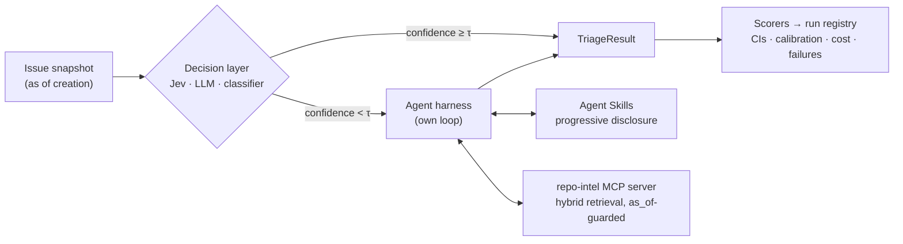

# triagelab

**An eval-driven GitHub issue-triage system.** A cheap, typed decision model handles routine calls. An LLM agent with MCP tools and repo-specific Agent Skills handles the hard ones. Every design choice is justified by measurement: accuracy with confidence intervals, calibration, cost and failure analysis.

[](https://github.com/ish-codes-magic/triage-bench/actions/workflows/ci.yml)


[](LICENSE)

> **Status: M0–M2 of 10 complete** (foundations, dataset, baselines and scoring). Results so far are on the dev split with silver labels; the test set stays locked until M8. Negative results are reported as prominently as positive ones.

---

## The question

Most LLM demos show that something *works*. This project asks **when it is worth it**, and tests five hypotheses instead of assuming them:

| | Hypothesis |
|---|---|
| **H1** | Repo-specific Agent Skills beat generic instructions, at an acceptable token cost. |
| **H2** | Retrieving context on demand via MCP tools beats stuffing it into the prompt, on both accuracy and cost. |
| **H3** | A typed decision model with confidence-based escalation matches the full agent on routine decisions at a fraction of the cost. |
| **H4** | The harness transfers to a new repository by swapping only the skill. |
| **H5** | Each decision backend's confidences are (or are not) well calibrated in this domain. |

**Tasks:**
- issue labels (T1)
- duplicate detection (T2)
- component routing (T3)
- needs-more-info detection (T4)
- a draft triage comment (T5), scored by an LLM judge that is itself validated against human labels

Ground truth comes from real maintainer actions on public repositories. Every input is frozen at issue-creation time, and tests enforce that no later information leaks in.

## Architecture



- **Evaluation is offline and frozen:** dataset snapshots, a local index, and cached model responses, so any run can be reproduced exactly.
- **The core is written from scratch:**
  - the agent loop
  - progressive skill loading
  - the cascade policy
  - every metric, including bootstrap CIs and calibration

  This is deliberate: the point is to understand what agent frameworks hide.

## First results: do cheap baselines already solve it? (E1)

**Dev split (n = 100), silver labels, 95% bootstrap intervals.** This is not the headline test-set table yet: the test set stays locked until M8.

| system | T1 labels micro-F1 | T1 area F1 | T3 component acc. | T3 top-3 | T4 needs-info F1 | $/issue |
|---|---|---|---|---|---|---|
| majority class | 0.40 [0.32, 0.49] | 0.37 [0.26, 0.49] | 0.26 [0.15, 0.38] | 0.76 | 0.00 | $0 |
| **TF-IDF + logistic regression** | **0.71 [0.64, 0.77]** | **0.65 [0.56, 0.74]** | 0.65 [0.52, 0.77] | **0.94** | 0.09 [0.00, 0.26] | $0 |
| Qwen3.5-9B, single call, no tools | 0.59 [0.54, 0.64] | 0.57 [0.48, 0.67] | 0.69 [0.56, 0.80] | 0.89 | 0.20 [0.05, 0.36] | $0.00015 |
| Qwen3.5-9B, single call, thinking on | 0.69 [0.63, 0.74] | 0.65 [0.57, 0.74] | 0.76 [0.64, 0.87] | 0.93 | 0.20 [0.05, 0.37] | $0.00026 |

- **Negative result first.** A 9B model answering directly is **significantly worse than TF-IDF at labelling**: paired difference −0.12 [−0.19, −0.06] in T1 micro-F1.
  - Letting it think first gains **+0.10 [+0.06, +0.14]** and closes the gap (vs. TF-IDF: −0.02 [−0.09, +0.05], no evidence of a difference), at 1.7× the cost. → [iteration 2](docs/ITERATIONS.md#iteration-2-does-thinking-pay-for-a-9b-model)
  - On components and needs-info there's no evidence either way at this sample size.
  - The bar for the agent (skills and retrieval tools, M4) is TF-IDF's 0.71: it has to *beat* a free baseline, not tie it.
- **Duplicates need retrieval.** Lexical nearest-neighbour search finds almost none (link-F1 0.11 [0.00, 0.32]), and a model without tools can't find them at all.
- **The first measured iteration was a prompt-formatting fix.**
  - The prompt listed labels as `area: stdlib, …`, and the model answered `area-stdlib` on 57% of issues.
  - Listing exact strings raised area F1 by **+0.475 [+0.349, +0.591]**.
  - This was caught because invented labels are recorded, not silently dropped. → [iteration log](docs/ITERATIONS.md)

Full table: [reports/results/dev.md](reports/results/dev.md) (regenerated from the run registry with `triagelab results --split dev`).

## Finding the original of a duplicate: time-aware retrieval (M3)

202 duplicates from the train and dev windows, each searched **as of the moment it was opened**. 152 are reachable (their original is in the index at that moment). The table covers reachable queries, with 95% bootstrap intervals.

| retriever | Recall@1 | Recall@10 | MRR |
|---|---|---|---|
| BM25 (own, time-aware) | 0.37 [0.30, 0.45] | 0.65 [0.57, 0.72] | 0.47 [0.40, 0.54] |
| dense (arctic-embed-s, local CPU) | 0.54 [0.45, 0.62] | 0.76 [0.70, 0.83] | 0.62 [0.55, 0.69] |
| hybrid (reciprocal rank fusion) | 0.52 [0.44, 0.60] | 0.76 [0.68, 0.82] | 0.61 [0.55, 0.68] |

- **Embeddings matter.** Dense retrieval beats BM25 by **+0.14 MRR [+0.08, +0.21]** (paired bootstrap on the same queries). Duplicates describe the same bug in different words.
- **Negative result: fusion added nothing over dense** here (−0.002 [−0.046, +0.042]). Hybrid stays the default because agent-written queries will be short and identifier-heavy, and M4 re-measures that choice. → [ADR-0023](docs/DECISIONS.md#adr-0023-hybrid-search-stays-the-default-no-query-prefix)
- **Coverage is the other ceiling.** A quarter of originals predate the indexed history, so over *all* duplicates the best Recall@10 is 0.57.
- **Even the statistics are time-aware.** Off-the-shelf BM25 computes IDF over the whole corpus, which lets future issues shape past rankings. Ours uses only what existed at query time, and a test proves that adding future documents never changes a past score.

Full report: [reports/retrieval/python__cpython.md](reports/retrieval/python__cpython.md) (`triagelab retrieval eval`).

## The agent (M4, then 3 measured iterations): what do tools buy?

Our own agent loop over the `repo-intel` MCP server, with the CPython Agent Skill available on demand. Same model as the single-shot baseline (Qwen3.5-9B, thinking on), same label vocabulary, same issue text. Dev split, n = 100, silver labels.

| system | T1 micro-F1 | T2 duplicate link-F1 | T3 accuracy | T3 top-3 | $/issue | p50 latency |
|---|---|---|---|---|---|---|
| TF-IDF classifier | 0.71 [0.64, 0.77] | 0.11 [0.00, 0.32] | 0.65 [0.52, 0.77] | 0.94 | $0 | 0.1 s |
| single-shot LLM, thinking | 0.69 [0.63, 0.74] | 0.00 | 0.76 [0.64, 0.87] | 0.93 | $0.00026 | 23 s |
| agent v1 (M4) | 0.72 [0.66, 0.77] | 0.43 [0.13, 0.67] | 0.72 [0.60, 0.83] | 0.80 | $0.0072 | 164 s |
| **agent, after iterations 3–5** | 0.73 [0.67, 0.78] | **0.43 [0.13, 0.67]** | **0.82 [0.70, 0.91]** | 0.93 | $0.0065 | 99 s |

- **Tools buy retrieval.** The agent is the only system that finds duplicates' originals: **+0.33 [+0.07, +0.57]** link-F1 over nearest-neighbour search, and **+0.44 [+0.13, +0.67]** over the model without tools.
- **And now components.** After the iterations, the agent beats TF-IDF on component routing, **+0.17 [+0.04, +0.29]**. Against the single-shot LLM there's no evidence either way (+0.06 [−0.07, +0.18]).
- **Negative result: labels.** There's no evidence of a gain over a free classifier (+0.02 [−0.05, +0.09] T1 micro-F1), at about 25× the single-shot cost.
- **What the iterations showed** (→ [iteration log](docs/ITERATIONS.md)):
  - **Worked:**
    - a one-line **schema** fix (a required top-3 field: +0.15 top-3, and +0.07 top-1 as a side effect);
    - a **mechanical** repeat guard (−9% cost at equal accuracy).
  - **Didn't work:** *telling* the model how to behave. Forcing the repository skill into context changed nothing measurable, and in-context "you already searched this" notes didn't stop the rephrasing.
  - **Consequence for H1** (do skills help?): at 9B, **no**. M6's ablations confirm it, and show what does matter (below).

Agent behaviour: [v1](reports/agent/dev-agent-v1.md) and [after iteration 5](reports/agent/dev-agent-iter5.md) (`triagelab runs stats`). Traces: JSONL per run, plus OpenTelemetry spans viewable in Arize Phoenix.

## What actually matters (M6): seven ablations, three iterations, one regression gate

Each experiment is a config file that differs from the reference agent in **one** block. Each is compared with the reference by a paired bootstrap on the same issues. Dev split, scored on the adjudicated labels (n = 97). Silver results and every interval: [reports/experiments](reports/experiments/m6-ablations-gold.md).

| system | labels micro-F1 | duplicate link-F1 | component acc. | $/issue | p50 latency |
|---|---|---|---|---|---|
| TF-IDF classifier | 0.72 [0.67, 0.77] | 0.11 | 0.72 | $0 | 0.1 s |
| single-shot LLM, thinking + confidence floor | 0.76 [0.71, 0.80] | 0.00 | 0.76 | $0.0003 | 23 s |
| **agent (reference, after iterations 6–8)** | **0.83 [0.78, 0.88]** | 0.29 | 0.84 | $0.0068 | 89 s |
| E2: agent without any skill | 0.82 [0.77, 0.86] | 0.36 | 0.85 | $0.0067 | 81 s |
| E3: **no tools**, top-8 similar issues pasted in | 0.82 [0.78, 0.87] | 0.40 | 0.84 | **$0.0011** | 69 s |
| E4: planner + 2 subagents + synthesizer | 0.79 [0.75, 0.83] | 0.18 | 0.86 | $0.0036 | 111 s |
| E5: same harness, Qwen3.5-27B | **0.90 [0.86, 0.94]** | 0.45 | **0.91** | $0.0243 | 76 s |

**Findings, negative ones included:**

- **H1 (skills help): not supported at 9B.**
  - No skill variant differs from *no skill* on any metric. That covers a generic skill, the hand-written CPython skill and one generated automatically from CONTRIBUTING and the train split, all loaded on the first call.
  - CPython skill vs. none on labels: +0.008 [−0.030, +0.049].
  - The 27B, by contrast, loads the skill unprompted on 72% of issues (the 9B: about 1%).
- **H2 (on-demand tools beat stuffing): not supported.**
  - Pasting the 8 most similar earlier issues into the prompt matches the tool-using agent on every metric: labels −0.009 [−0.059, +0.037], components ±0.000.
  - It costs **1/6** as much.
  - The agent's real lead over a single LLM call (+0.075 [+0.027, +0.127] on labels, with the same post-processing on both) comes from *retrieving labelled neighbours*, not from multi-step tool use.
- **Multi-agent didn't pay.** Narrow roles halved the cost but slightly hurt labels (−0.042 [−0.081, +0.001]) and duplicate finding (−0.10).
- **Model size did.**
  - The 27B on the identical harness is the only arm significantly better than the reference: labels **+0.070 [+0.031, +0.110]**, type **+0.095**, area **+0.092**, at 3.6× the cost.
  - **Caveat:** on silver labels the gain shrinks to +0.010 (not significant). The adjudicated labels come from an LLM annotator, which may favour a stronger model's answers.
- **Iterations** (→ [log](docs/ITERATIONS.md)): two kept, one reverted.

  | iteration | change | effect | decision |
  |---|---|---|---|
  | 6 | tools return the component that owns each file | area labels +0.060; target category −8 | kept |
  | 7 | stricter answer schema | worse | reverted |
  | 8 | drop topic/OS labels the model gives < 0.95 confidence | labels **+0.056 [+0.037, +0.077]**; over-labeling 42 → 8 | kept |

  - Iteration 8's floor was chosen on dev and confirmed by cross-fitting.
  - The lesson across iterations 3–8: with a 9B model, change what the harness computes and filters, not what the model is asked to judge.

**The regression gate** ([`eval.yml`](.github/workflows/eval.yml), → [ADR-0040](docs/DECISIONS.md#adr-0040-the-real-api-regression-gate-fixed-subset-blessed-baseline-point-estimate-thresholds)):
- **How it runs:**
  - A PR labelled `run-eval` runs the reference agent for real on a fixed 50-issue subset, behind an approval-protected environment and a $1 cap.
  - The run is compared with a committed, blessed baseline, and a delta table with paired-bootstrap intervals and failure-category deltas is posted on the PR.
- **When it fails:**
  - a headline metric drops beyond its threshold;
  - cost per issue rises by more than 30%;
  - fallback answers exceed 6%;
  - any baseline issue is missing.
- **What CI downloads:** a checksummed eval pack with every test-period row removed at packing time.
- **Dry runs:** a [pass](reports/gate/dry-run.md) and a [fail](reports/gate/dry-run-regression.md).

## Measuring the measurement (M5): label noise, adjudicated labels, a calibrated judge

**Provenance first.** At the owner's request, the adjudicated ("gold") labels and the comment ratings in this section were made by a **model annotator** (Claude Opus 5.5), not a person. Every record says so (ADR-0035).

The process was the one designed for a human:
- a blind pass from exactly what the systems see;
- then adjudication with the evidence (who applied which label, the fixing PRs' files, duplicate closures).

**Label noise, silver vs. adjudicated, dev (97 usable issues):**

| task | κ | finding |
|---|---|---|
| type label | 0.72 | Maintainers often label demonstrated segfaults as `type-bug`. |
| component | 0.90 | The derived component sometimes follows side files (`configure`, generated headers). |
| duplicates | 1.00 | Every maintainer duplicate closure held up. |
| **needs-info** | **0.00** | Silver (from the `pending` label) flags 15 issues; adjudication flags **none**. `pending` means "awaiting a decision", so **T4 as derived doesn't measure missing information**. |

**Results re-scored on the adjudicated labels** (free, from stored predictions: `triagelab results --labels gold`):

| system | labels micro-F1 | duplicate link-F1 | component acc. |
|---|---|---|---|
| TF-IDF classifier | 0.72 [0.67, 0.77] | 0.11 [0.00, 0.36] | 0.72 [0.62, 0.81] |
| single-shot LLM, thinking | 0.70 [0.65, 0.74] | 0.00 | 0.76 [0.67, 0.84] |
| **agent** | **0.75 [0.71, 0.80]** | **0.45 [0.14, 0.70]** | 0.80 [0.72, 0.88] |

- **Cleaner labels change conclusions** (paired bootstrap):
  - On type labels the agent now **beats TF-IDF, +0.11 [+0.03, +0.19]**, where silver showed no evidence. A plausible reading: TF-IDF learns the maintainers' labeling habits.
  - The agent's component lead over TF-IDF shrinks to no evidence (+0.08 [−0.02, +0.19]).
  - The agent now beats the single-shot LLM on labels (+0.05 [+0.01, +0.10]).
- **Caveat:** labels adjudicated by an LLM may favour LLM-shaped answers. A human spot-check would bound this.

**T5 comment judge** (GPT-6 Luna) against the rater:
- The prompt was tuned once on judge-dev, then measured **once** on judge-test (n = 46).
- Correctness QWK **0.57** and actionability QWK **0.50**, with over 90% of scores within one point.
- **Tone is not validated:** QWK 0.17, because the judge scores tone about 0.7 higher.
- Padding a comment with polite filler *lowers* its tone score, so there's no verbosity bias.

**Why the agent fails** (failure taxonomy v1: 60 failures open-coded into 20 codes, merged into 10 categories; → [docs/FAILURE_TAXONOMY.md](docs/FAILURE_TAXONOMY.md)):
- **Mostly label judgement, not retrieval:**
  - topic/OS labels added for a mere mention (28);
  - the wrong half of a module, or the symptom's location instead of the fix's (24);
  - crash vs. bug (17).
- **Retrieval causes only 9.**
- **The rules that prevent these errors are in the repository skill,** which the 9B model neither loads nor follows.
- **An LLM tagger reproduces 6 of the 10 categories at κ ≥ 0.6**, and its counts appear in every run report. The other four are marked unvalidated.

## The dataset: CPython issues, exactly as they were opened

5,476 [python/cpython](https://github.com/python/cpython) issues (May 2025 – Aug 2026), with silver ground truth for all four tasks. See the [dataset card](data/DATASET_CARD.md) and the [generated report](reports/data/python__cpython.md).

- **Leakage, measured.**
  - **70% of CPython issue bodies today name the PR that fixed them**: a bot appends a "Linked PRs" section after triage.
  - Every snapshot is rebuilt from GitHub's edit history as of the moment the issue was opened: **0 of 5,476 snapshots contain that section.**
  - A mutation test proves that no post-creation field can change what the model sees. It runs as its own CI check ("Leakage guard").
- **Chosen by evidence.**
  - The obvious candidate (transformers) looked 100% labelled, but only 3% of its recent issues had a label applied by a human triager; the rest came from issue templates.
  - Repos were compared by *who applied each label*. → [ADR-0011](docs/DECISIONS.md#adr-0011-primary-repo-is-pythoncpython-chosen-by-label-provenance)
- **Every label has provenance.**
  - Each label is tagged as applied by the author, a triager or a bot.
  - Duplicates record which evidence they came from.
  - Components come from the fixing PRs' changed files, mapped with the maintainers' own area definitions.
- **Small, honest samples.**
  - dev 100 / test 50, split by time and stratified so rare cases (2.6% are duplicates) are present.
  - Sampling weights let every metric also be reported at natural rates.

## Engineering highlights (built so far)

- **A budget hard stop that can't be overshot.**
  - Before every call, the worst-case cost (`max_tokens` at the output rate, plus a provable byte-based ceiling on prompt tokens) is checked against both the per-run and all-time caps.
  - The actual cost is charged afterwards and appended to a spend ledger.
  - Prices come from a reviewed table that cites its sources, not from a library's silently changing map. → [ADR-0005](docs/DECISIONS.md#adr-0005-our-own-price-table-and-a-worst-case-budget-check)
- **A content-addressed response cache.**
  - Keys cover only what can change the answer, plus a sample index so repeated samples for consistency measurement stay distinct.
  - Entries are written atomically.
  - The same files double as deterministic CI cassettes. → [ADR-0006](docs/DECISIONS.md#adr-0006-content-addressed-json-response-cache)
- **Pinned model routes.**
  - Small open-weight models (Qwen3.5-9B) are served via OpenRouter, with every call pinned to one provider *and* numeric precision. Otherwise one model name silently maps to fp4, fp8 and bf16 deployments.
  - Models whose training cutoff isn't published are dated by their release, so none can have seen the evaluation issues. → [ADR-0010](docs/DECISIONS.md#adr-0010-small-open-weight-models-via-openrouter-pinned-per-role)
- **The provider behind a protocol.**
  - LiteLLM lives in one adapter, with its import-time network fetch, hidden retries and silent parameter dropping all turned off.
  - Everything else is tested offline against a fake backend. → [ADR-0003](docs/DECISIONS.md#adr-0003-litellm-behind-our-own-client)
- **A read-only MCP server with the time cutoff enforced server-side.**
  - `repo-intel` exposes five tools: similar issues, a past issue as of a date, code search on a frozen checkout, CODEOWNERS, components.
  - Every tool is annotated read-only and returns bounded, structured output.
  - The cutoff (`as_of`) is enforced three ways: the corpus refuses later issues, the server has an optional ceiling, and the agent harness removes `as_of` from every schema the model sees and injects it. The prompt is never the control.
  - Tested in three layers: unit tests, a real MCP client in-process, and a scripted run of the official MCP Inspector. → [ADR-0021](docs/DECISIONS.md#adr-0021-the-repo-intel-mcp-server)
- **An agent harness written by hand.**
  - A loop with a validated `submit_triage` tool as the final answer, fed-back validation errors, forced answers near per-issue budgets, and deterministic context compaction. → [ADR-0024](docs/DECISIONS.md#adr-0024-native-tool-calling-with-the-final-answer-as-a-tool)
  - A synchronous MCP client (anyio blocking portal) talks to `repo-intel` as a real stdio subprocess.
  - Agent Skills with progressive disclosure, held to the open spec by tests.
  - Every model and tool call is traced to JSONL and to OpenTelemetry spans (OpenInference attributes, viewable in Phoenix).
- **Human evaluation, instrumented.**
  - A Streamlit labeling app (tested end to end with Streamlit's AppTest) collects gold labels in two passes: first **blind**, from exactly what the systems see, then **adjudicated** against the evidence. Blind-vs-final agreement measures how much the evidence moves the annotator. → [ADR-0031](docs/DECISIONS.md#adr-0031-gold-labels-are-collected-blind-then-adjudicated-with-evidence)
  - The same tasks run from files (`triagelab annotate`), with validated imports and an annotator recorded on every label. That's how the model annotator worked. → [ADR-0035](docs/DECISIONS.md#adr-0035-the-owner-delegated-labeling-to-a-model-annotator-claude-recorded-as-such)
  - An LLM judge for triage comments is calibrated against human ratings with quadratic-weighted κ. It also gets verbosity and position bias checks, and a guard that allows one judge-test measurement per frozen judge version.
  - Failures are open-coded into a taxonomy, and an LLM tagger is validated against the human tags before its counts appear in run reports. Guidelines: [docs/LABELING_GUIDE.md](docs/LABELING_GUIDE.md).
- **Jobs that survive being killed.**
  - The 12k-issue embedding build is resumable and keyed by issue number, with atomic chunk writes.
  - It was stopped twice under memory pressure and finished without redoing work.
- **Free re-scoring by cache replay.** A post-processing change re-runs every experiment from cached model answers: identical requests, $0, and byte-identical answers, verified by matching answer costs.
- **Safe parallel runs.** The spend ledger is appended under a cross-process OS lock, after two Windows processes interleaved their appends and lost an entry. A 4-process stress test guards it. → [ADR-0037](docs/DECISIONS.md#adr-0037-the-spend-ledger-is-appended-under-a-cross-process-file-lock)
- **Run provenance.**
  - Every run records its resolved config, config fingerprint, git SHA (flagged if dirty), versions and cost.
  - Run folders are claimed atomically and never overwritten.
- **CI/CD as a first-class concern.**
  - SHA-pinned actions and a least-privilege token.
  - The same pre-commit hooks locally and in CI, with workflows linted by actionlint.
  - An Ubuntu + Windows test matrix, and Dependabot for both actions and the `uv` lockfile.
  - A path-filtered MCP workflow runs the MCP client contract tests and builds the wheel only when the server or retrieval code changes.
  - **CI for an LLM agent:** every PR replays a 10-issue agent eval from recorded model responses (cassettes) through the real stdio MCP server. It's free and deterministic across OSes (recorded on Windows, replayed on Linux), and any changed prompt, skill or tool output fails the build. Trace stats go to the job summary, and traces are uploaded as artifacts. → [ADR-0030](docs/DECISIONS.md#adr-0030-cassettes-are-the-response-cache-replayed-read-only)
  - **A regression gate for an LLM system** (`eval.yml`):
    - the real API on a fixed subset, approval-gated, capped at $1 and at one run a week;
    - paired-bootstrap deltas, failure-category deltas and a coverage rule;
    - a committed baseline, and an eval pack that cannot contain test rows.
  - Planned: an approval-gated, audited one-time test-set evaluation.
- **Verify, don't remember.** Before any code, every external API was checked against current docs, and several contradicted older assumptions. → [M0 learning note](docs/learning/M0-foundations.md)

## Roadmap

- [x] **M0 Foundations:** config, cached and budgeted model client, run registry, CLI, hardened CI
- [x] **M1 Data:** collection, creation-time snapshots, ground-truth derivation, time splits, leakage tests
- [x] **M2 Baselines + scorers:** eval runner, metrics with bootstrap CIs, first results table
- [x] **M3 MCP server + retrieval:** `repo-intel` server, hybrid BM25 + dense retrieval, `as_of` guard
- [x] **M4 Harness + skills:** our own agent loop, progressive skill disclosure, tracing
- [x] **M5 Gold labels, judge, failure taxonomy** (labels by a model annotator, ADR-0035)
- [x] **M6 Iteration loop + LLM regression gate in CI:** iterations 6–8, ablations E2–E5, `eval.yml`
- [ ] **M7 Decision layer:** Jev, LLM and classifier backends, calibration, cascade
- [ ] **M8 Transfer repo + one-time test-set evaluation**
- [ ] **M9 Report, results site, demo**

## Quickstart

```bash
uv sync                          # Python 3.12 + locked dependencies
uv run triagelab --help
uv run triagelab config show     # the resolved config and its fingerprint

cp .env.example .env             # add OPENROUTER_API_KEY
uv run triagelab llm ping        # one structured call: logged, costed, cached
uv run triagelab llm ping        # the second one is a cache hit and costs $0
uv run triagelab runs list       # run registry and all-time spend vs. budget

# Dataset (needs GITHUB_TOKEN in .env; ~15 min, ~400 GraphQL points)
uv run triagelab data collect -p configs/repos/python__cpython.yaml
uv run triagelab data build   -p configs/repos/python__cpython.yaml

# Evaluate (dev split; the test split needs --allow-test and is capped at two runs)
uv run triagelab eval -c configs/experiments/e1-classifier.yaml --split dev
uv run triagelab compare runs/<run_a> runs/<run_b>   # paired-bootstrap deltas
uv run triagelab results --split dev                 # reports/results/dev.md

# Retrieval + MCP server (embedding ~12k issues takes ~30 min on CPU; resumable)
uv run triagelab data collect -p configs/repos/python__cpython.yaml --index-history
uv run triagelab data checkout -p configs/repos/python__cpython.yaml   # frozen source tree
uv run triagelab retrieval build -p configs/repos/python__cpython.yaml
uv run triagelab retrieval eval  -p configs/repos/python__cpython.yaml
uv run triagelab mcp serve -p configs/repos/python__cpython.yaml       # stdio
bash scripts/mcp_inspector_check.sh                                    # official MCP Inspector

# The agent (~1 h and ~$0.75 for 100 dev issues; everything is cached)
uv run triagelab eval -c configs/experiments/agent.yaml --split dev
uv run triagelab runs stats runs/<run_id>          # tools, skills, budgets, cost per issue
PHOENIX_WORKING_DIR=.phoenix uvx --from arize-phoenix==20.16.0 phoenix serve   # trace viewer
bash scripts/phoenix_check.sh 3                    # re-send 3 issues' traces (free from cache)
```

Development:

```bash
uv run pre-commit install        # the same hooks CI runs
uv run pytest
```

## Repository layout

```
configs/            base.yaml, prices.yaml (verified, cited), experiments/ (one YAML per ablation)
configs/repos/      per-repo ground-truth rules (taxonomy, component map, windows)
src/triagelab/      config · cost · cache · ledger · retry · llm_client · litellm_backend · wiring · cli
  data/             GitHub collector · creation-time snapshots · ground truth · splits · report
  eval/             runner · metrics · bootstrap · report · run registry
  baselines/        majority · TF-IDF + logistic regression · single-shot LLM
  retrieval/        time-aware corpus · own BM25 · dense index · RRF · embedding store · benchmark
  mcp_server/       repo-intel: five read-only tools, as_of guard, code search, CODEOWNERS
  harness/          agent loop · tools · MCP client · budgets · compaction · tracing · agent
  skills/           Agent Skills loader (progressive disclosure)
skills/             the skills themselves: triage-cpython (+ references/), generic-triage
data/DATASET_CARD.md, reports/  dataset card, generated data/results/retrieval/agent reports
docs/               DECISIONS.md (ADRs) · learning/ (one note per milestone)
.github/            CI + path-filtered MCP workflows, composite setup action, Dependabot
scripts/            MCP Inspector check (layer 3 of the server tests), Phoenix trace check
tests/              unit and integration tests, offline by default; cassettes/ (recorded model responses)
```

## License

MIT
