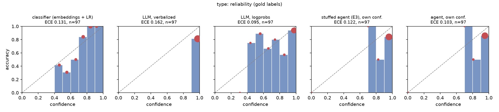
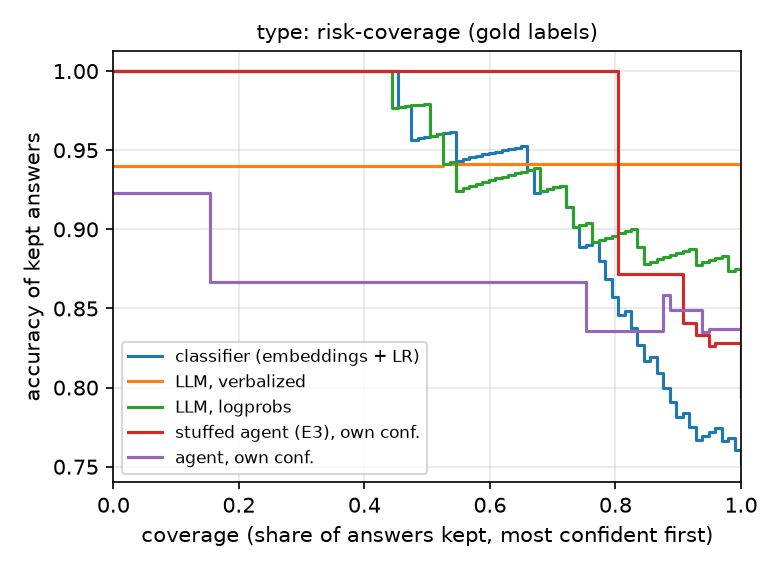
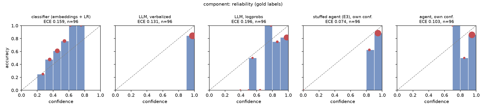
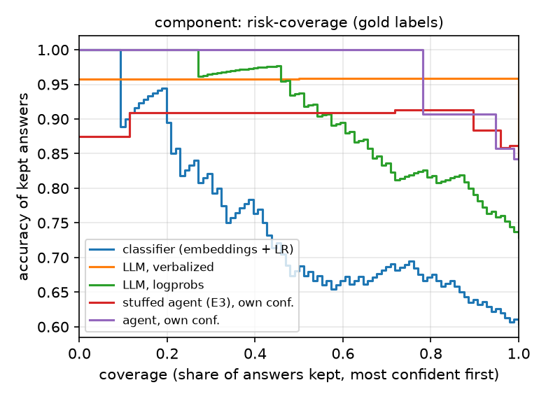

# E6: decision backends and their confidences, dev (gold labels)

## type

| source | n | accuracy [95% CI] | mean conf. | ECE [95% CI] | ECE (equal-mass) | Brier [95% CI] | AURC | $/issue |
|---|---|---|---|---|---|---|---|---|
| classifier (embeddings + LR) | 97 | 0.753 [0.670, 0.835] | 0.731 | 0.131 [0.095, 0.201] | 0.140 | 0.133 [0.105, 0.166] | 0.066 | $0.00000 |
| LLM, verbalized | 97 | 0.814 [0.732, 0.887] | 0.976 | 0.162 [0.094, 0.243] | 0.162 | 0.171 [0.106, 0.246] | 0.120 | $0.00016 |
| LLM, logprobs | 97 | 0.866 [0.794, 0.928] | 0.867 | 0.095 [0.060, 0.173] | 0.081 | 0.116 [0.074, 0.165] | 0.048 | $0.00015 |
| stuffed agent (E3), own conf. | 97 | 0.794 [0.711, 0.876] | 0.910 | 0.122 [0.056, 0.193] | 0.122 | 0.144 [0.083, 0.207] | 0.104 | $0.00114 |
| agent, own conf. | 97 | 0.794 [0.711, 0.876] | 0.891 | 0.103 [0.036, 0.176] | 0.099 | 0.139 [0.077, 0.202] | 0.151 | $0.00673 |

 

Slices (n is small: read them as warnings, not estimates):

| source | slice | n | accuracy | mean conf. | ECE |
|---|---|---|---|---|---|
| classifier (embeddings + LR) | all | 97 | 0.75 | 0.73 | 0.131 |
| classifier (embeddings + LR) | short (body < 300 chars) | 9 | 0.22 | 0.54 | 0.440 |
| classifier (embeddings + LR) | mostly logs/code (> 50% fenced lines) | 11 | 0.82 | 0.81 | 0.169 |
| LLM, verbalized | all | 97 | 0.81 | 0.98 | 0.162 |
| LLM, verbalized | short (body < 300 chars) | 9 | 0.56 | 0.96 | 0.400 |
| LLM, verbalized | mostly logs/code (> 50% fenced lines) | 11 | 0.91 | 0.98 | 0.073 |
| LLM, logprobs | all | 97 | 0.87 | 0.87 | 0.095 |
| LLM, logprobs | short (body < 300 chars) | 9 | 0.78 | 0.68 | 0.267 |
| LLM, logprobs | mostly logs/code (> 50% fenced lines) | 11 | 0.91 | 0.91 | 0.125 |
| stuffed agent (E3), own conf. | all | 97 | 0.79 | 0.91 | 0.122 |
| stuffed agent (E3), own conf. | short (body < 300 chars) | 9 | 0.56 | 0.78 | 0.289 |
| stuffed agent (E3), own conf. | mostly logs/code (> 50% fenced lines) | 11 | 0.82 | 0.96 | 0.145 |
| agent, own conf. | all | 97 | 0.79 | 0.89 | 0.103 |
| agent, own conf. | short (body < 300 chars) | 9 | 0.67 | 0.84 | 0.283 |
| agent, own conf. | mostly logs/code (> 50% fenced lines) | 11 | 0.82 | 0.96 | 0.141 |

## component

| source | n | accuracy [95% CI] | mean conf. | ECE [95% CI] | ECE (equal-mass) | Brier [95% CI] | AURC | $/issue |
|---|---|---|---|---|---|---|---|---|
| classifier (embeddings + LR) | 96 | 0.604 [0.500, 0.698] | 0.449 | 0.159 [0.085, 0.259] | 0.170 | 0.241 [0.219, 0.261] | 0.249 | $0.00000 |
| LLM, verbalized | 96 | 0.844 [0.771, 0.917] | 0.975 | 0.131 [0.062, 0.202] | 0.131 | 0.144 [0.078, 0.211] | 0.099 | $0.00016 |
| LLM, logprobs | 96 | 0.729 [0.635, 0.812] | 0.907 | 0.196 [0.137, 0.280] | 0.179 | 0.185 [0.120, 0.252] | 0.094 | $0.00015 |
| stuffed agent (E3), own conf. | 96 | 0.844 [0.771, 0.917] | 0.917 | 0.074 [0.018, 0.139] | 0.104 | 0.118 [0.064, 0.174] | 0.101 | $0.00114 |
| agent, own conf. | 96 | 0.844 [0.771, 0.906] | 0.941 | 0.103 [0.039, 0.177] | 0.097 | 0.135 [0.081, 0.198] | 0.093 | $0.00673 |

 

Slices (n is small: read them as warnings, not estimates):

| source | slice | n | accuracy | mean conf. | ECE |
|---|---|---|---|---|---|
| classifier (embeddings + LR) | all | 96 | 0.60 | 0.45 | 0.159 |
| classifier (embeddings + LR) | short (body < 300 chars) | 9 | 0.56 | 0.37 | 0.185 |
| classifier (embeddings + LR) | mostly logs/code (> 50% fenced lines) | 11 | 0.73 | 0.43 | 0.301 |
| LLM, verbalized | all | 96 | 0.84 | 0.97 | 0.131 |
| LLM, verbalized | short (body < 300 chars) | 9 | 0.67 | 0.96 | 0.294 |
| LLM, verbalized | mostly logs/code (> 50% fenced lines) | 11 | 0.73 | 0.97 | 0.245 |
| LLM, logprobs | all | 96 | 0.73 | 0.91 | 0.196 |
| LLM, logprobs | short (body < 300 chars) | 9 | 0.67 | 0.87 | 0.240 |
| LLM, logprobs | mostly logs/code (> 50% fenced lines) | 11 | 0.36 | 0.85 | 0.532 |
| stuffed agent (E3), own conf. | all | 96 | 0.84 | 0.92 | 0.074 |
| stuffed agent (E3), own conf. | short (body < 300 chars) | 9 | 0.67 | 0.80 | 0.133 |
| stuffed agent (E3), own conf. | mostly logs/code (> 50% fenced lines) | 11 | 0.82 | 0.91 | 0.095 |
| agent, own conf. | all | 96 | 0.84 | 0.94 | 0.103 |
| agent, own conf. | short (body < 300 chars) | 9 | 1.00 | 0.91 | 0.094 |
| agent, own conf. | mostly logs/code (> 50% fenced lines) | 11 | 0.82 | 0.93 | 0.114 |

ECE uses 10 equal-width bins; AURC is the area under the risk (1 - accuracy) vs coverage curve (lower is better). Intervals: 1,000 issue resamples. Runs: classifier (embeddings + LR) `20261001-073202-e6-classifier-8d261e`, LLM, verbalized `20261001-075558-e6-llm-verbalized-ddb893`, LLM, logprobs `20261001-075558-e6-llm-logprobs-f968e2`, stuffed agent (E3), own conf. `20261001-000322-e3-stuffed-c7868d`, agent, own conf. `20260930-233640-agent-1f32af`.
