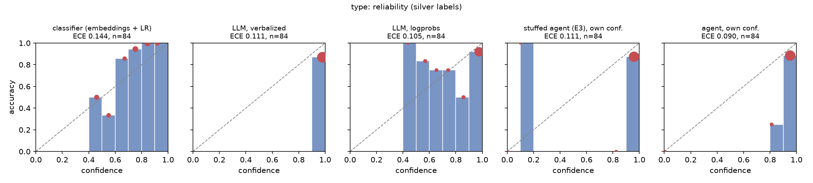
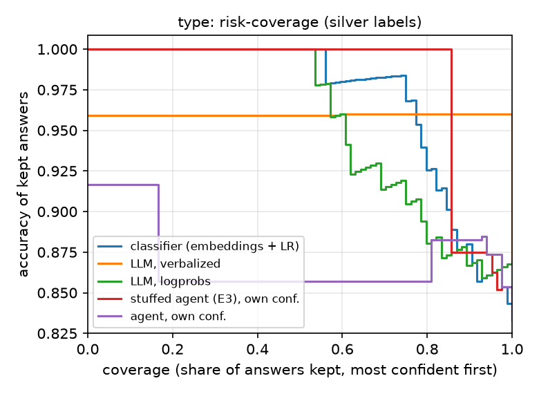
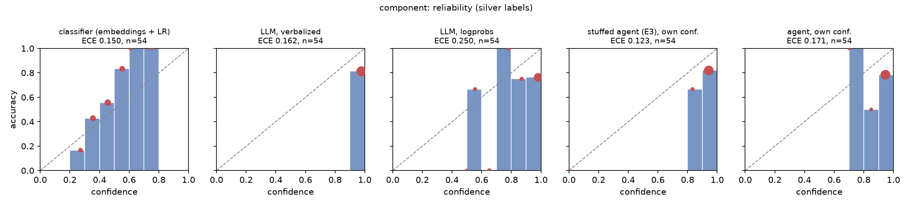
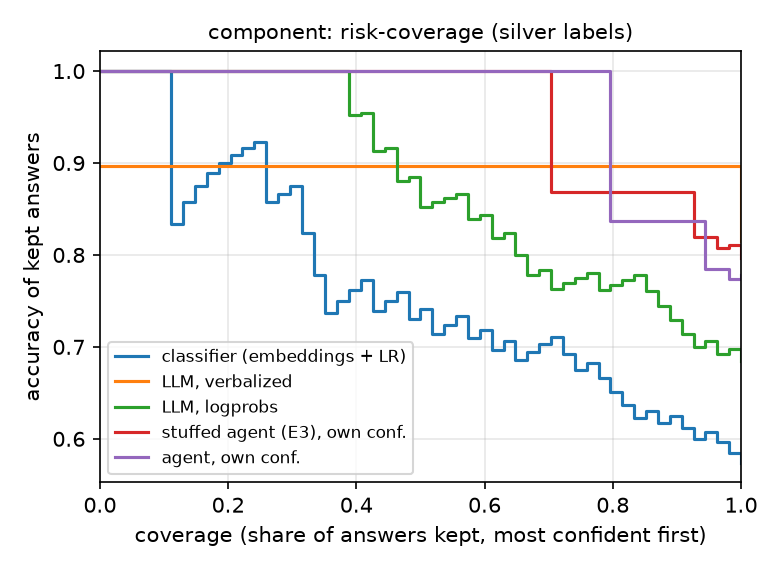

# E6: decision backends and their confidences, dev (silver labels)

## type

| source | n | accuracy [95% CI] | mean conf. | ECE [95% CI] | ECE (equal-mass) | Brier [95% CI] | AURC | $/issue |
|---|---|---|---|---|---|---|---|---|
| classifier (embeddings + LR) | 84 | 0.833 [0.762, 0.905] | 0.736 | 0.144 [0.111, 0.212] | 0.134 | 0.104 [0.080, 0.129] | 0.032 | $0.00000 |
| LLM, verbalized | 84 | 0.869 [0.798, 0.929] | 0.980 | 0.111 [0.049, 0.182] | 0.111 | 0.121 [0.065, 0.187] | 0.077 | $0.00016 |
| LLM, logprobs | 84 | 0.869 [0.798, 0.929] | 0.899 | 0.105 [0.060, 0.185] | 0.116 | 0.123 [0.073, 0.178] | 0.045 | $0.00015 |
| stuffed agent (E3), own conf. | 84 | 0.833 [0.750, 0.905] | 0.923 | 0.111 [0.045, 0.189] | 0.115 | 0.134 [0.074, 0.201] | 0.091 | $0.00114 |
| agent, own conf. | 84 | 0.833 [0.750, 0.905] | 0.923 | 0.090 [0.026, 0.160] | 0.149 | 0.124 [0.062, 0.186] | 0.115 | $0.00673 |

 

Slices (n is small: read them as warnings, not estimates):

| source | slice | n | accuracy | mean conf. | ECE |
|---|---|---|---|---|---|
| classifier (embeddings + LR) | all | 84 | 0.83 | 0.74 | 0.144 |
| classifier (embeddings + LR) | short (body < 300 chars) | 8 | 0.25 | 0.56 | 0.398 |
| classifier (embeddings + LR) | mostly logs/code (> 50% fenced lines) | 10 | 0.90 | 0.80 | 0.200 |
| LLM, verbalized | all | 84 | 0.87 | 0.98 | 0.111 |
| LLM, verbalized | short (body < 300 chars) | 8 | 0.75 | 0.96 | 0.206 |
| LLM, verbalized | mostly logs/code (> 50% fenced lines) | 10 | 1.00 | 0.98 | 0.015 |
| LLM, logprobs | all | 84 | 0.87 | 0.90 | 0.105 |
| LLM, logprobs | short (body < 300 chars) | 8 | 0.88 | 0.78 | 0.288 |
| LLM, logprobs | mostly logs/code (> 50% fenced lines) | 10 | 1.00 | 0.90 | 0.102 |
| stuffed agent (E3), own conf. | all | 84 | 0.83 | 0.92 | 0.111 |
| stuffed agent (E3), own conf. | short (body < 300 chars) | 8 | 0.62 | 0.69 | 0.287 |
| stuffed agent (E3), own conf. | mostly logs/code (> 50% fenced lines) | 10 | 0.90 | 0.96 | 0.064 |
| agent, own conf. | all | 84 | 0.83 | 0.92 | 0.090 |
| agent, own conf. | short (body < 300 chars) | 8 | 0.50 | 0.88 | 0.375 |
| agent, own conf. | mostly logs/code (> 50% fenced lines) | 10 | 0.90 | 0.95 | 0.055 |

## component

| source | n | accuracy [95% CI] | mean conf. | ECE [95% CI] | ECE (equal-mass) | Brier [95% CI] | AURC | $/issue |
|---|---|---|---|---|---|---|---|---|
| classifier (embeddings + LR) | 54 | 0.574 [0.444, 0.704] | 0.447 | 0.150 [0.087, 0.273] | 0.170 | 0.224 [0.196, 0.255] | 0.242 | $0.00000 |
| LLM, verbalized | 54 | 0.815 [0.704, 0.907] | 0.977 | 0.162 [0.069, 0.269] | 0.162 | 0.173 [0.086, 0.277] | 0.141 | $0.00016 |
| LLM, logprobs | 54 | 0.685 [0.574, 0.815] | 0.898 | 0.250 [0.159, 0.367] | 0.215 | 0.228 [0.139, 0.325] | 0.126 | $0.00015 |
| stuffed agent (E3), own conf. | 54 | 0.796 [0.685, 0.907] | 0.919 | 0.123 [0.031, 0.232] | 0.144 | 0.161 [0.079, 0.250] | 0.135 | $0.00114 |
| agent, own conf. | 54 | 0.778 [0.667, 0.889] | 0.938 | 0.171 [0.070, 0.275] | 0.162 | 0.195 [0.101, 0.288] | 0.159 | $0.00673 |

 

Slices (n is small: read them as warnings, not estimates):

| source | slice | n | accuracy | mean conf. | ECE |
|---|---|---|---|---|---|
| classifier (embeddings + LR) | all | 54 | 0.57 | 0.45 | 0.150 |
| classifier (embeddings + LR) | short (body < 300 chars) | 5 | 0.40 | 0.34 | 0.415 |
| classifier (embeddings + LR) | mostly logs/code (> 50% fenced lines) | 6 | 0.50 | 0.41 | 0.204 |
| LLM, verbalized | all | 54 | 0.81 | 0.98 | 0.162 |
| LLM, verbalized | short (body < 300 chars) | 5 | 0.40 | 0.97 | 0.570 |
| LLM, verbalized | mostly logs/code (> 50% fenced lines) | 6 | 0.67 | 0.97 | 0.300 |
| LLM, logprobs | all | 54 | 0.69 | 0.90 | 0.250 |
| LLM, logprobs | short (body < 300 chars) | 5 | 0.40 | 0.91 | 0.513 |
| LLM, logprobs | mostly logs/code (> 50% fenced lines) | 6 | 0.17 | 0.81 | 0.723 |
| stuffed agent (E3), own conf. | all | 54 | 0.80 | 0.92 | 0.123 |
| stuffed agent (E3), own conf. | short (body < 300 chars) | 5 | 0.40 | 0.73 | 0.330 |
| stuffed agent (E3), own conf. | mostly logs/code (> 50% fenced lines) | 6 | 0.83 | 0.92 | 0.083 |
| agent, own conf. | all | 54 | 0.78 | 0.94 | 0.171 |
| agent, own conf. | short (body < 300 chars) | 5 | 0.80 | 0.90 | 0.220 |
| agent, own conf. | mostly logs/code (> 50% fenced lines) | 6 | 0.83 | 0.92 | 0.142 |

ECE uses 10 equal-width bins; AURC is the area under the risk (1 - accuracy) vs coverage curve (lower is better). Intervals: 1,000 issue resamples. Runs: classifier (embeddings + LR) `20261001-073202-e6-classifier-8d261e`, LLM, verbalized `20261001-075558-e6-llm-verbalized-ddb893`, LLM, logprobs `20261001-075558-e6-llm-logprobs-f968e2`, stuffed agent (E3), own conf. `20261001-000322-e3-stuffed-c7868d`, agent, own conf. `20260930-233640-agent-1f32af`.
