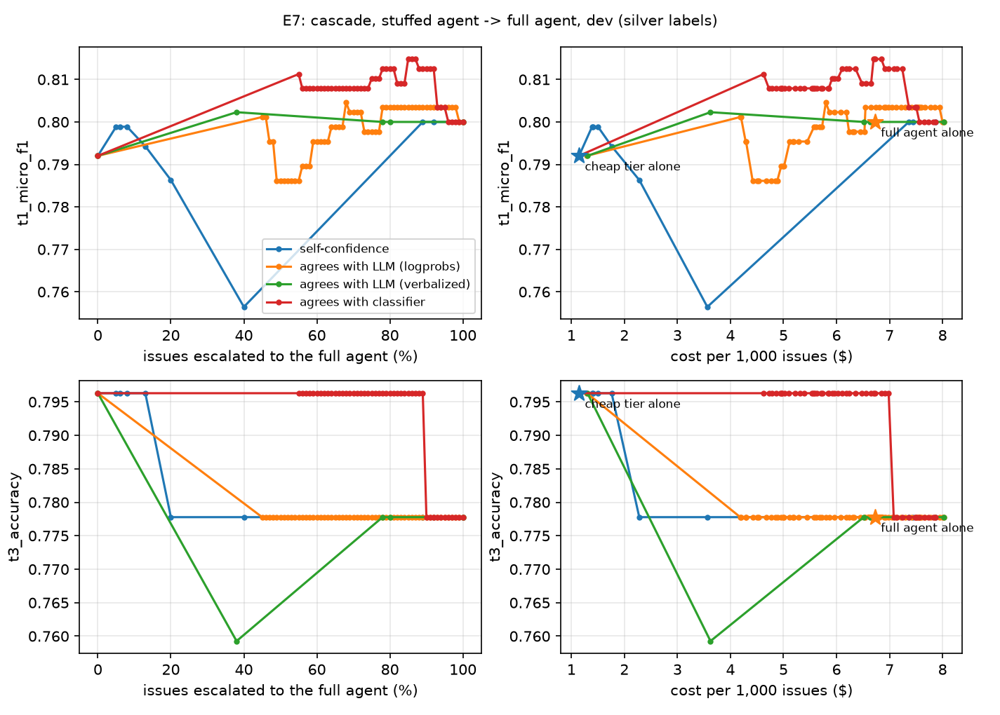

# E7: cascade, stuffed agent -> full agent, dev (silver labels)

Cheap tier `20261001-000322-e3-stuffed-c7868d`; full agent `20260930-233640-agent-1f32af`; n = 100 issues. τ is the cheapest threshold whose t1_micro_f1, t3_accuracy stay within 0.0 of the full agent's on dev.

| system | τ | escalated | t1_micro_f1 | t3_accuracy | cost / 1,000 issues |
|---|---|---|---|---|---|
| cheap tier alone | | 0% | 0.792 | 0.796 | $1.14 |
| full agent alone | | 0% | 0.800 | 0.778 | $6.73 |
| self-confidence | 0.990 | 89% | 0.800 | 0.778 | $7.36 |
| self-confidence, cross-fitted (τ 0.00, 0.99) | | 54% | 0.789 | 0.796 | $4.83 |
| agrees with LLM (logprobs) | 0.412 | 45% | 0.801 | 0.778 | $4.18 |
| agrees with LLM (logprobs), cross-fitted (τ 0.00, 0.93) | | 41% | 0.791 | 0.796 | $3.99 |
| agrees with LLM (verbalized) | 0.990 | 78% | 0.800 | 0.778 | $6.51 |
| agrees with LLM (verbalized), cross-fitted (τ 0.00, 0.99) | | 44% | 0.786 | 0.796 | $4.12 |
| agrees with classifier | 0.287 | 55% | 0.811 | 0.796 | $4.62 |
| agrees with classifier, cross-fitted (τ 0.00, 0.48) | | 48% | 0.801 | 0.815 | $4.28 |

Cascade at the chosen τ minus the full agent (paired bootstrap, 1,000 resamples):

| gate | metric | Δ [95% CI] |
|---|---|---|
| self-confidence | t1_micro_f1 | +0.000 [+0.000, +0.000] |
| self-confidence | t3_accuracy | +0.000 [+0.000, +0.000] |
| agrees with LLM (logprobs) | t1_micro_f1 | +0.001 [-0.031, +0.033] |
| agrees with LLM (logprobs) | t3_accuracy | +0.000 [+0.000, +0.000] |
| agrees with LLM (verbalized) | t1_micro_f1 | +0.000 [-0.012, +0.012] |
| agrees with LLM (verbalized) | t3_accuracy | +0.000 [+0.000, +0.000] |
| agrees with classifier | t1_micro_f1 | +0.011 [-0.012, +0.037] |
| agrees with classifier | t3_accuracy | +0.019 [+0.000, +0.059] |

Cross-fitted rows route each issue by the τ chosen on the other half of dev, so they estimate what the chosen τ does on unseen issues.
