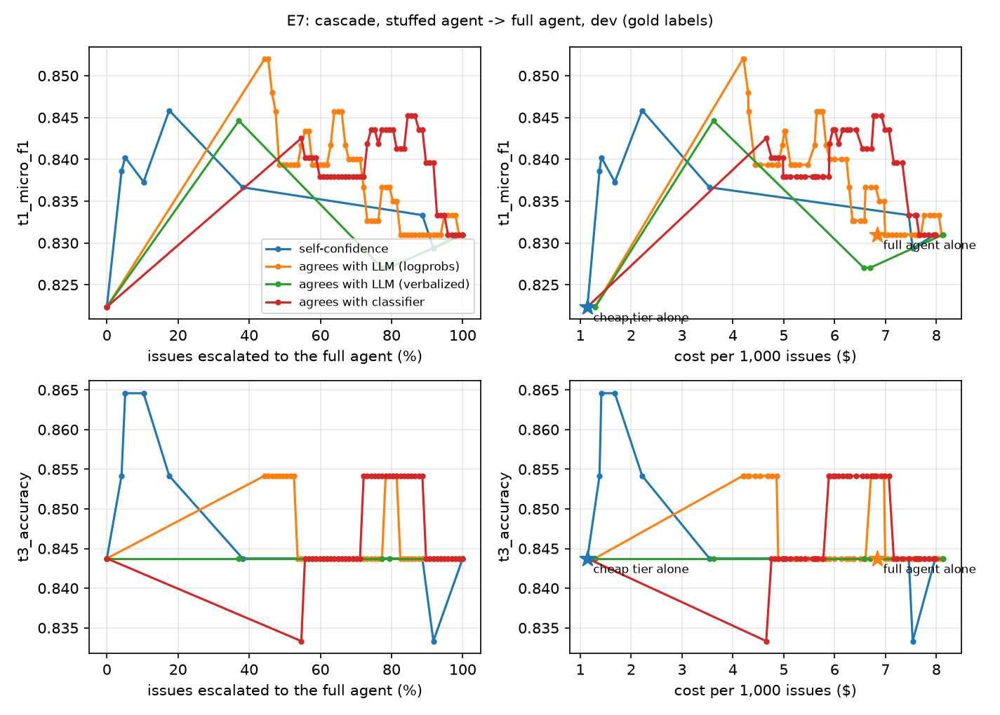

# triagelab: results

An eval-driven GitHub issue-triage system. A cheap tier handles routine decisions, an LLM agent with MCP tools and repo-specific Agent Skills handles the rest, and every design choice is measured: accuracy with confidence intervals, calibration, cost, consistency and failure analysis. Start with the [technical report](../REPORT.md); the code and the decision log are in the [repository](../../README.md).

## The held-out test set, evaluated once

50 issues each from `python/cpython` and `astral-sh/uv` (the transfer repository). The configs, the code and the analysis plan were frozen in git before any test issue was scored. Cells are point estimates with 95% bootstrap intervals against adjudicated labels, which were made by a model annotator, not a human.

| | CPython: routed system | CPython: full agent | uv: routed system | uv: full agent |
|---|---|---|---|---|
| Labels (T1), micro-F1 | 0.88 [0.83, 0.92] | 0.80 [0.72, 0.87] | 0.70 [0.60, 0.79] | 0.75 [0.65, 0.85] |
| Type label | 1.00 (50 of 50) | 0.88 [0.79, 0.96] | 0.78 [0.66, 0.88] | 0.77 [0.65, 0.88] |
| Component (T3), accuracy | 0.73 [0.60, 0.84] | 0.81 [0.69, 0.92] | 0.56 [0.40, 0.71] | 0.68 [0.53, 0.82] |
| Cost per 1,000 issues | $1.36 | $6.50 | $1.84 | $10.15 |
| p50 latency | 170 s | 107 s | 202 s | 148 s |

All five systems, the planned paired comparisons and the limits of these numbers: [test-set results](../test-eval/RESULTS.md).

## What the measurements say

- **The cheap system holds up on labels at a fifth of the cost** on CPython: +0.08 [+0.02, +0.15] micro-F1 over the full agent.
- **Its component routing did not hold up.** The typed backend equalled the agent on dev (0.84) and scored 0.73 on test. It was the one decision *chosen* on dev, and the one number that fell below its dev interval.
- **Cheaper is not faster.** The routed system was slower than the full agent on both repositories.
- **The choice of system does not transfer.** On uv the full agent leads and the routed system is no better than a single model call. The harness itself transferred after one fix.
- **On uv the systems fail where triage matters.** They get the type right on 31–32 of the 34 issues nobody re-labelled, and on 5–7 of the 16 a maintainer triaged.
- **Typed decisions are consistent; agents are not.** Over three runs on dev the routed system's type label was identical on 99% of issues. The full agent's accuracy is 0.77, but it is right in all three runs on only 0.67 of issues: [consistency](../consistency/dev-gold.md).
- **A perfect score was audited before it was reported.** The 1.00 is an easier sample, not a leak: [leak audit](../test-eval/context-audit.md).

## One issue, end to end

The cheap tier runs out of output tokens and gives no answer, the gate escalates, and the full agent answers with tools. Generated from the stored traces of a real run: [the same steps as text](trace.md).

## Cost against accuracy

The cascade curve on dev: each point is a confidence threshold, from "the cheap tier answers everything" to "the full agent answers everything". Details: [calibration and cascade](../cascade/e7-gold.md).

