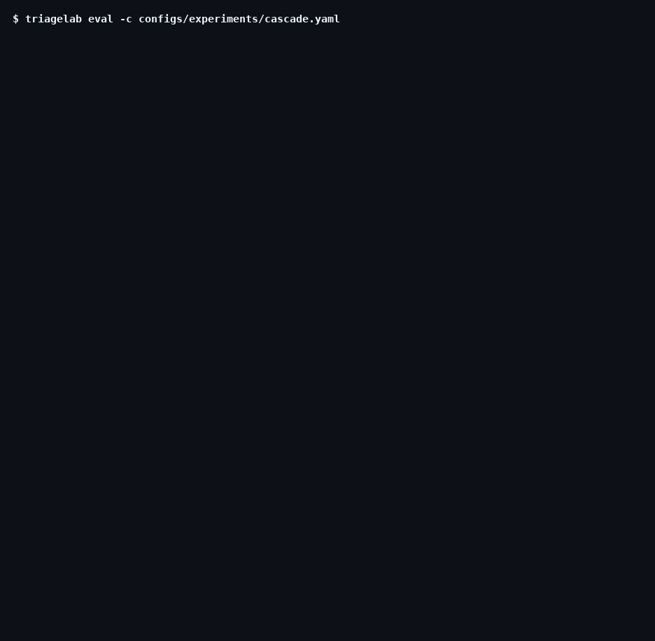

# One issue through the cascade

`python/cpython#151987`, a dev-split issue, as the live cascade handled it. This page is generated from the run's stored traces (`triagelab demo runs/20261002-120927-cascade-c5cf23 "python/cpython#151987"`), so it shows what happened, including the steps that don't flatter the system.



```text
$ triagelab eval -c configs/experiments/cascade.yaml

python/cpython#151987   opened 2026-06-23
  Tarfile.extract doesn't fully respect the filter parameter
  In the `Tarfile.extract` function, the `filter` parameter is not called properly when extracting
  a hardlink whose target is not present (and the file is extracted from the archive rather than
  linked).

1  cheap tier: similar past issues pasted into the prompt, no tools
   → load_skill(triage-cpython)
   model call 2: 4,000 tokens, hit the output limit, no answer
   model call 3: 4,000 tokens, hit the output limit, no answer
   no answer after 3 model calls   $0.0022

2  gate: confidence 0.00 < τ 0.70   →   escalate to the full agent

3  full agent: tools over MCP, each limited to what existed on 2026-06-23
   → search_similar_issues("Tarfile.extract filter parameter hardlink")   10 results, top #151558
   → get_issue(#151558)
   → search_code("hardlink", Lib/tarfile.py)   2 hits
   → search_code("extract", Lib/tarfile.py)   3 hits
   → search_code("def extract", Lib/tarfile.py)   3 hits
   → search_code("hardlink", Lib/tarfile.py)   2 hits
   → search_code("is_hardlink", Lib/tarfile.py)   0 hits
   → search_code("type=hardlink", Lib/tarfile.py)   0 hits
   → search_code("linktype", Lib/tarfile.py)   0 hits
   → search_code("linkname", Lib/tarfile.py)   3 hits
   → search_code("def extract\(self", Lib/tarfile.py)   0 hits
   step limit reached: forced to answer now   $0.0060

result   (decided by the full agent, after escalation)
   labels      type-security, stdlib
   component   stdlib
   duplicate   none
   comment     "This issue appears to be a duplicate of #151558 which describes the same security
               vulnerability where tarfile.extract doesn't properly respect the filter parameter
               when extracting hardlinks whose target is not present. The issue was opened on …
   cost        $0.0082 for this issue, all tiers

reference   type-security · component stdlib      ✓ type   ✓ component
```
